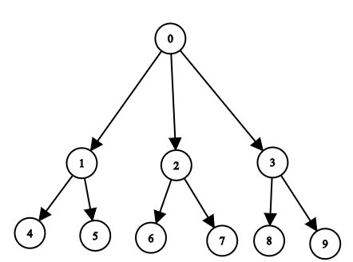

# Graph-algorithms

Graphs are mathematical structures that represent pairwise relationships between objects. A graph is a flow structure that represents the relationship between various objects. It can be visualized by using the following two basic components:

- <b>Nodes</b>: These are the most important components in any graph. Nodes are entities whose relationships are expressed using edges. If a graph comprises 2 nodes <b>A</b> and <b>B</b> and an undirected edge between them, then it expresses a bi-directional relationship between the nodes and edge.

- <b>Edges</b>: Edges are the components that are used to represent the relationships between various nodes in a graph. An edge between two nodes expresses a one-way or two-way relationship between the nodes.

## Graph Representations

### Matrix Form
Adjacency Matrix is a 2D array of size V x V where V is the number of vertices in a graph. 

### Graph Used


### Adjacency List
An adjacency list is a collection of unordered lists used to represent a finite graph. Each list describes the set of neighbors of a vertex in the graph. ```the code uses adjancency list```

## Standard Template Libraries in C++
It is a set of C++ template classes that provide generic classes and function that can be used to implement data structures and algorithms.
STL provides numerous containers and algorithms which are very useful in competitive programming , for example you can very easily define a linked list in a single statement by using list container of container library in STL , saving your time and effort.

## Depth First Search
DFS processes a graph such that when following a path in the graph, it will not switch to another path from a node until it hasn't processed all node in that path, hence going to depth in a particular path and then backtracking to explore other paths.
The basic idea is as follows:
- Pick a starting node and push all its adjacent nodes into a stack.
- Pop a node from stack to select the next node to visit and push all its adjacent nodes into a stack.
- Repeat this process until the stack is empty.

File : [Code for DFS](dfs.cpp)

## Breadth First Search
BFS processes a graph such that when following a path in the graph, it will first process all the nodes that reside at the same level. The algorithm moves to next level only when all the nodes at current level are processed.
The basic idea is as follows:
- Pick a starting node and push all its adjacent nodes into a queue.
- Pop a node from front of queue to select the next node to visit and push all its adjacent nodes into a back of the queue.
- Repeat this process until the queue is empty.

File : [Code for BFS](bfs.cpp)
